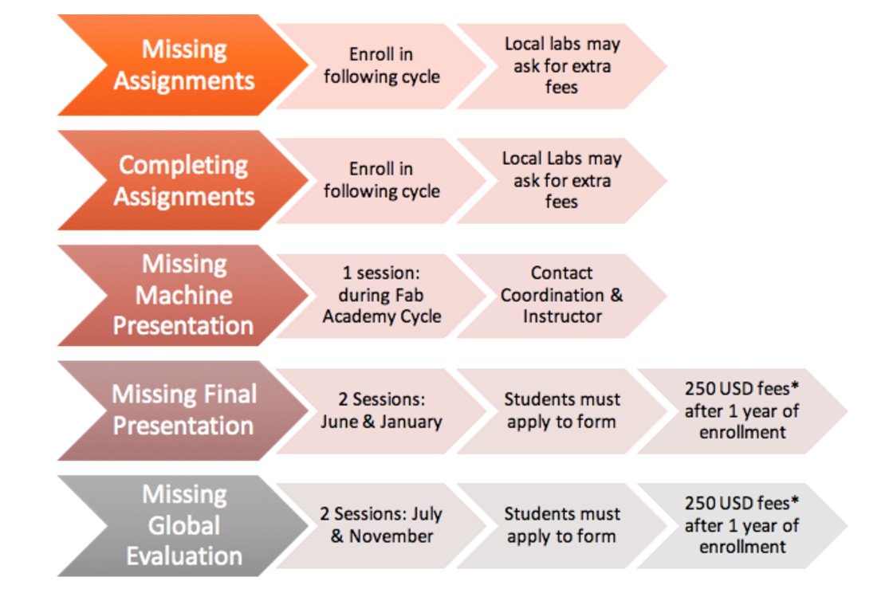

# Tuition and Fee's and Payment policies

## Tuition fees for 2017

| PROGRAM             | TUITION FEES |
| -------             | -------------|
|Fab Academy 2017     |5000 USD*     |
|Bio Academy 2016-17  |5000 USD*     |
|WTMAA (Why to Make (almost) Anything)|To be announced|
|MTM (Machine that Make)|To be announced|
*Note: European labs may charge 5000€, please check with your node.*

## 1.1 Tuition Deposit and Installments

Two weeks after the student receives the acceptance letter from Central Coordination, he/she will have to reserve his/her place at the program by paying the non-refundable Tuition Deposit, which is part of the total tuition fees.

| PROGRAM   | TUITION DEPOSIT |
| --------- | -------------   |  
|Fab Academy|2000 USD*        |
|Bio Academy|2000 USD*        |
*Note: European labs may charge 2000€, please check with your node.*

After this first payment, the student will have to pay the rest of tuition fees accomplishing the following installments:

| PROGRAM   | 1st installment | 2nd installment |
| --------- | -------------   |  -------------- |
|Fab Academy|1500 USD* - before January 1st     | 1500 USD - Before March 15th       |
|Bio Academy|1500 USD* - before August 1st      | 1500 USD - Before October 15th     |
*Note: European labs may charge euros (€), please check with your node.*

## 1.2 Invoicing

If students need an invoice to pay their fees, they must contact Central Coordination (coordination@fabacademy.org) as soon as they receive their Acceptance letter and provide the following information:

If a company or an institution is paying for the fees:
* Full name of the company/institution
* Full legal address of the company/institution
* VAT identification number
* Contact email to send the invoice

If you or any other person is paying the fees:
* Full name and address
* Passport or personal identification number

Central coordination will only issue one invoice for the total amount of the program, to be paid in one instalment or splitted as described in point 1.1.

Invoices will not be issued once the program is over.

## 2.1 Cancellation of the program

Each Lab reserves the right to cancel a Program if the quota of registered students is not complete.  In the case that a Lab cancels a Program, 100% of paid tuition fees will be refunded.

## 2.2 Student’s withdrawal from the Program

A student choosing to withdraw from a program is to provide notice in writing to Central Coordination and Local Lab.
Students who drop the course and had paid part of the tuition fees, will have partial refund according to the following situations:

### 2.2.1 Nonrefundable Tuition Deposit
Tuition Deposit (1.2), also known as the admission deposit, commitment deposit, down payment or commitment fee, required to students who have been admitted to verify their intention to enroll, is non-refundable.

### 2.2.2  Withdrawal Programs prior to the official beginning of class period
If the student paid part or the totality of the Program’s tuition fees prior to the class period, and communicates the withdrawal, Central Coordination will reimburse the 85% of the fees paid that exceeds the Tuition Deposit (1.2), and reserves the 15% in concept of administrative costs.

IMPORTANT: to be subject to refund, the student must give proper justification of the reason for withdrawal.

### 2.2.3 Withdrawal Programs after official beginning of class period
 There is no refund of any kind after the official beginning of classes.

## 2.3      Ceasing attendance without notification
If a student fails to deliver the assignments requested by the instructors, misses the evaluation periods, does not cover 90% of classes and/or fails to attend more than 15 consecutive classes, Central Coordination understands that the student abandoned the program. In this situation, the student loses all the accomplished credits and any right to claim for refund. In addition, Central Coordination will not deliver the student’s diploma nor any kind of certificate requested.

## 3. Calendar

### 3.1 Fab Academy

Application Process: September to November
Prospective students interested in enrolling in Fab Academy must fill an online form to become eligible for it. Once Central Coordination receives the applications with the prospective’s profile, this information will be sent to the local lab/node selected. Local labs/nodes will review the prospective student’s profile and inform Central Coordination of whether they are accepted or not. After the selection process, Central Coordination will send the prospective student an Acceptance letter with details of the program and payment instructions.

Enrollment Period: December to mid-January
A prospective student that has received an Acceptance Letter to Fab Academy must pay the tuition deposit (1.1) to become enrolled in the same. Only then, the student can start classes.

Graduation: August
Students that pass all the evaluation stages are receiving a Diploma. Graduation ceremony takes place  during the annual Fab Conferences, usually during the month of August.

## 3.2 Bio Academy

Application & Enrollment: coming soon
Classes: late August to mid-January
Evaluation: coming soon
Graduation: August

## 4. Continuing Students

Students that have enrolled and started the program, but were unable to finish it in the natural terms of it (3.1 and 3.2), may finish the program later on, see guidelines below for more information.

